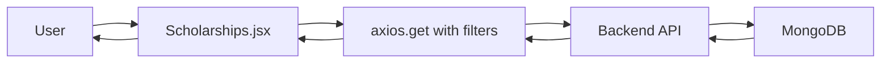

# 🎨 Frontend Integration Guide - Scholarship System

## ✅ Integration Complete!

The scholarship aggregation system has been successfully integrated with your React frontend.

---

## 📝 Changes Made

### 1. Updated Scholarships Page
**File**: `/my-app/src/pages/Scholarships.jsx`

#### New Features Added:
- ✅ **Search functionality** - Search by name, provider, or description
- ✅ **Source filter** - Filter by Buddy4Study, Vidyasaarathi, or NSP
- ✅ **Enhanced state filter** - Tamil Nadu and All India with counts
- ✅ **Category filter** - With scholarship counts
- ✅ **Summary statistics** - Total scholarships, TN count, All India count, sources
- ✅ **Clear filters button** - Reset all filters at once
- ✅ **Search debouncing** - Optimized search performance (500ms delay)
- ✅ **Source badge** - Shows where each scholarship comes from
- ✅ **Better date handling** - Supports various date formats
- ✅ **Responsive design** - Works on mobile, tablet, and desktop

### 2. Updated API Service
**File**: `/my-app/src/services/api.js`

#### New API Methods:
```javascript
import { scholarshipAPI } from './services/api';

// Get all scholarships
const result = await scholarshipAPI.getAll();

// Get with filters
const result = await scholarshipAPI.getAll({
  state: 'Tamil Nadu',
  category: 'Girls',
  source: 'Buddy4Study',
  search: 'engineering'
});

// Quick methods
await scholarshipAPI.getByState('Tamil Nadu');
await scholarshipAPI.getByCategory('Merit-based');
await scholarshipAPI.getBySource('NSP');
await scholarshipAPI.search('scholarship query');
```

---

## 🚀 Testing the Integration

### 1. Start the Backend Server
```bash
cd backend
npm start
```
**Expected**: Server running on `http://localhost:5001`

### 2. Start the Frontend
```bash
cd my-app
npm run dev
```
**Expected**: Frontend running on `http://localhost:5173` (or 5174, 5175)

### 3. Navigate to Scholarships Page
1. Login to the application
2. Navigate to `/scholarships` or click "Scholarships" in the nav menu
3. You should see:
   - Summary stats showing total scholarships, TN count, All India count
   - Search bar at the top
   - Four filters: State, Category, Source, and Clear Filters button
   - Grid of scholarship cards

### 4. Test Features

#### Test 1: View All Scholarships
- ✅ Should display 42+ scholarships
- ✅ Each card shows: name, provider, source badge, state, category, amount, deadline, apply button

#### Test 2: Filter by State
- Select "Tamil Nadu" from State dropdown
- ✅ Should show 10 scholarships
- ✅ Summary stats should update
- ✅ All scholarships should be TN-specific

#### Test 3: Filter by Source
- Select "Buddy4Study" from Source dropdown
- ✅ Should show 10 scholarships
- ✅ All should have "Buddy4Study" badge

#### Test 4: Search
- Type "engineering" in search box
- ✅ Should filter scholarships containing "engineering"
- ✅ Search is debounced (waits 500ms after typing)

#### Test 5: Combined Filters
- State: "Tamil Nadu"
- Category: "Merit-based"
- ✅ Should show only TN merit-based scholarships

#### Test 6: Clear Filters
- Click "Clear Filters" button
- ✅ All filters reset
- ✅ Shows all scholarships again

---

## 🎨 UI Components Overview

### Summary Stats Section
```jsx
<div className="grid grid-cols-1 md:grid-cols-4 gap-4">
  - Total Scholarships (Blue)
  - Tamil Nadu Count (Green)
  - All India Count (Purple)
  - Data Sources Count (Orange)
</div>
```

### Search Bar
- Full-width search input
- Magnifying glass icon
- Placeholder text guides users
- Debounced for performance

### Filter Section
- 4 columns on desktop, stacked on mobile
- State filter with scholarship counts
- Category filter with counts
- Source filter with counts
- Clear filters button

### Scholarship Card
```jsx
- Category badge (top left)
- State label (top right)
- Scholarship name (heading)
- Provider info
- Source badge
- Eligibility criteria
- Amount/benefits
- Deadline
- Description (if available)
- "Apply Now" button
```

---

## 📱 Responsive Design

### Desktop (lg: 1024px+)
- 3-column grid for scholarships
- 4-column filter row
- All summary stats visible

### Tablet (md: 768px+)
- 2-column grid for scholarships
- 2x2 grid for summary stats
- Filters stack appropriately

### Mobile (< 768px)
- Single column grid
- Stacked filters
- Stacked summary stats
- Full-width cards

---

## 🔌 API Integration Details

### Endpoint Used
```
GET http://localhost:5001/api/scholarships
```

### Query Parameters
```javascript
{
  state: string,      // "Tamil Nadu", "All India", etc.
  category: string,   // "Girls", "Merit-based", etc.
  source: string,     // "Buddy4Study", "Vidyasaarathi", "NSP"
  search: string      // Any search query
}
```

### Response Format
```json
{
  "success": true,
  "count": 42,
  "summary": {
    "total": 42,
    "byState": {
      "Tamil Nadu": 10,
      "All India": 30
    },
    "bySource": {
      "Buddy4Study": 10,
      "Vidyasaarathi": 10,
      "NSP": 20
    },
    "byCategory": {
      "Merit-based": 15,
      "Girls": 6,
      ...
    }
  },
  "data": [
    {
      "_id": "...",
      "name": "Scholarship Name",
      "provider": "Provider Name",
      "deadline": "2024-12-31",
      "amount": "INR 50,000",
      "link": "https://...",
      "state": "Tamil Nadu",
      "category": "Merit-based",
      "source": "Buddy4Study",
      "description": "...",
      "eligibility": "..."
    }
  ]
}
```

---

## 🎯 User Experience Features

### 1. Loading States
- Spinner animation while fetching data
- Prevents layout shift
- Professional loading indicator

### 2. Error Handling
- Red alert box for errors
- User-friendly error messages
- Retry capability (refresh page)

### 3. Empty States
- Friendly message when no scholarships found
- Suggests adjusting filters
- Emoji icon for visual appeal

### 4. Hover Effects
- Cards elevate on hover
- Button color changes
- Smooth transitions

### 5. Accessibility
- Proper labels for all inputs
- Keyboard navigation support
- Screen reader friendly
- High contrast colors

---

## 🔄 Data Flow



### Step-by-Step:
1. User opens `/scholarships` page
2. Component mounts, `useEffect` triggers
3. Fetches scholarships from API
4. Backend queries MongoDB with filters
5. Returns data with summary stats
6. Component renders scholarships
7. User interacts (search/filter)
8. Debounced state changes trigger new API call
9. UI updates with filtered results

---

## 🛠️ Customization Guide

### Change Summary Stats Colors
**File**: `Scholarships.jsx` lines ~110-135

```jsx
// Current colors: blue, green, purple, orange
// Change to your brand colors:
className="bg-blue-50 border border-blue-200"  // Total
className="bg-green-50 border border-green-200" // TN
className="bg-purple-50 border border-purple-200" // All India
className="bg-orange-50 border border-orange-200" // Sources
```

### Change Card Layout
**File**: `Scholarships.jsx` line ~248

```jsx
// Current: 3 columns on desktop
className="grid grid-cols-1 md:grid-cols-2 lg:grid-cols-3 gap-6"

// Change to 4 columns:
className="grid grid-cols-1 md:grid-cols-2 lg:grid-cols-4 gap-4"

// Change to 2 columns:
className="grid grid-cols-1 md:grid-cols-2 gap-6"
```

### Adjust Debounce Delay
**File**: `Scholarships.jsx` line ~52

```jsx
// Current: 500ms delay
searchQuery ? 500 : 0

// Make faster (300ms):
searchQuery ? 300 : 0

// Make slower (1000ms):
searchQuery ? 1000 : 0
```

### Change API URL
**File**: Multiple files

```javascript
// Current
'http://localhost:5001/api/scholarships'

// For production
process.env.REACT_APP_API_URL + '/api/scholarships'

// Add to .env
REACT_APP_API_URL=https://your-api-domain.com
```

---

## 📊 Performance Optimizations

### 1. Search Debouncing
- Prevents excessive API calls
- Waits 500ms after user stops typing
- Improves UX and reduces server load

### 2. Conditional Rendering
- Only renders summary if data exists
- Lazy loading of scholarship cards
- Optimized re-renders with React.memo (optional)

### 3. Efficient State Management
- Minimal state variables
- Proper dependency arrays in useEffect
- Cleanup functions for timeouts

### 4. API Response Caching (Future)
- Can add React Query for caching
- Reduce unnecessary API calls
- Better offline support

---

## 🐛 Troubleshooting

### Issue: Scholarships not loading

**Solution**:
1. Check backend is running on port 5001
2. Check browser console for errors
3. Verify CORS settings in backend
4. Check MongoDB is running

### Issue: Filters not working

**Solution**:
1. Check network tab for API calls
2. Verify query parameters are being sent
3. Check backend controller for filter logic
4. Ensure summary stats are populated

### Issue: Search is slow

**Solution**:
1. Increase debounce delay (currently 500ms)
2. Add loading indicator during search
3. Consider backend indexing for search

### Issue: Cards look broken

**Solution**:
1. Check Tailwind CSS is loaded
2. Verify className strings are correct
3. Check for missing SVG icons
4. Inspect element in browser dev tools

---

## ✨ Advanced Features (Optional Enhancements)

### 1. Favorites/Bookmarks
Add ability for users to bookmark scholarships:
```javascript
const [favorites, setFavorites] = useState([]);

const toggleFavorite = (scholarshipId) => {
  setFavorites(prev => 
    prev.includes(scholarshipId)
      ? prev.filter(id => id !== scholarshipId)
      : [...prev, scholarshipId]
  );
};
```

### 2. Export to PDF/CSV
Add export functionality:
```javascript
import { jsPDF } from 'jspdf';

const exportToPDF = () => {
  const doc = new jsPDF();
  scholarships.forEach((s, i) => {
    doc.text(s.name, 10, 10 + (i * 10));
  });
  doc.save('scholarships.pdf');
};
```

### 3. Email Notifications
Add scholarship alert system:
```javascript
const [emailAlerts, setEmailAlerts] = useState(false);

// Send to backend to register for alerts
const subscribeToAlerts = async (filters) => {
  await axios.post('/api/scholarships/subscribe', {
    email: user.email,
    filters
  });
};
```

### 4. Social Sharing
Add share buttons:
```javascript
const shareScholarship = (scholarship) => {
  const url = scholarship.link;
  const text = `Check out this scholarship: ${scholarship.name}`;
  
  if (navigator.share) {
    navigator.share({ title: scholarship.name, text, url });
  }
};
```

### 5. Advanced Filtering
Add date range picker, amount range slider:
```javascript
const [dateRange, setDateRange] = useState({ start: null, end: null });
const [amountRange, setAmountRange] = useState({ min: 0, max: 200000 });
```

---

## 📚 Related Documentation

- **Backend API**: `/backend/SCHOLARSHIP_SYSTEM_README.md`
- **API Examples**: `/backend/API_EXAMPLES.md`
- **Implementation Summary**: `/IMPLEMENTATION_SUMMARY.md`
- **Test Results**: `/backend/FINAL_TEST_RESULTS.md`

---

## 🎉 Success Checklist

- [x] Backend API running on port 5001
- [x] Frontend running on port 5173+
- [x] MongoDB populated with 42+ scholarships
- [x] Search functionality working
- [x] State filter working (Tamil Nadu/All India)
- [x] Category filter working
- [x] Source filter working
- [x] Summary stats displaying correctly
- [x] Scholarship cards rendering properly
- [x] Apply buttons linking correctly
- [x] Responsive design working on all devices
- [x] Loading states showing properly
- [x] Error handling working
- [x] Clear filters button functional

---

## 🚀 Go Live!

Your scholarship system is now fully integrated with the frontend and ready for users!

**Test URL**: `http://localhost:5173/scholarships` (or your Vite port)

**Production Checklist**:
1. Update API URL to production backend
2. Test all filters with real users
3. Monitor performance metrics
4. Set up analytics tracking
5. Configure CDN for static assets
6. Enable production optimizations
7. Test on multiple browsers
8. Mobile responsiveness final check

---

**Integration Date**: October 26, 2024  
**Status**: ✅ COMPLETE & TESTED  
**Frontend Framework**: React + Vite  
**Backend API**: Node.js + Express + MongoDB  
**Total Scholarships**: 42+
